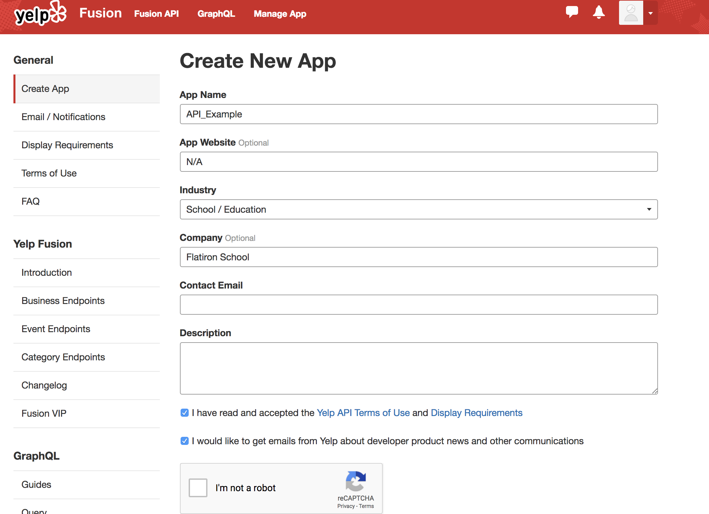

# Using APIs and JSON Data

## Objectives
You will be able to:
* Access and manipulate data inside a JSON file
* Pull data from an API and parse/transform the data

## Agenda

* Review JSON Schemas
* Introduce APIs.
* Walk through how to make an API request. 
* Practice making API requests and Parsing the data.


### What is the difference between a JSON and a python dictionary?

## Loading the JSON file

As before, we begin by importing the json package, opening a file with python's built in function, and then loading that data in.


```python
import json
f = open('data/output.json')
data = json.load(f)

```

## Exploring JSON Schemas  

Recall that JSON files have a nested structure. The most granular level of raw data will be individual numbers (float/int) and strings. These in turn will be stored in the equivalent of python lists and dictionaries. Because these can be combined, we'll start exploring by checking the type of our root object, and start mapping out the hierarchy of the json file.


```python

```

As you can see, in this case, the first level of the hierarchy is a dictionary. Let's explore what keys are within this:


```python
data.keys()
```

In this case, there is only a single key, 'albums', so we'll continue on down the pathway exploring and mapping out the hierarchy. Once again, let's start by checking the type of this nested data structure.


```python
data['albums'].keys()
```


    dict_keys(['href', 'items', 'limit', 'next', 'offset', 'previous', 'total'])


```python
data['albums']['items'][1]
```


    {'album_type': 'single',
     'artists': [{'external_urls': {'spotify': 'https://open.spotify.com/artist/3TVXtAsR1Inumwj472S9r4'},
       'href': 'https://api.spotify.com/v1/artists/3TVXtAsR1Inumwj472S9r4',
       'id': '3TVXtAsR1Inumwj472S9r4',
       'name': 'Drake',
       'type': 'artist',
       'uri': 'spotify:artist:3TVXtAsR1Inumwj472S9r4'}],
     'available_markets': ['AD',
      'AR',
      'AT',
      'AU',
      'BE',
      'BG',
      'BO',
      'BR',
      'CH',
      'CL',
      'CO',
      'CR',
      'CY',
      'CZ',
      'DE',
      'DK',
      'DO',
      'EC',
      'EE',
      'ES',
      'FI',
      'FR',
      'GB',
      'GR',
      'GT',
      'HK',
      'HN',
      'HU',
      'ID',
      'IE',
      'IS',
      'IT',
      'JP',
      'LI',
      'LT',
      'LU',
      'LV',
      'MC',
      'MT',
      'MY',
      'NI',
      'NL',
      'NO',
      'NZ',
      'PA',
      'PE',
      'PH',
      'PL',
      'PT',
      'PY',
      'SE',
      'SG',
      'SK',
      'SV',
      'TR',
      'TW',
      'UY'],
     'external_urls': {'spotify': 'https://open.spotify.com/album/0geTzdk2InlqIoB16fW9Nd'},
     'href': 'https://api.spotify.com/v1/albums/0geTzdk2InlqIoB16fW9Nd',
     'id': '0geTzdk2InlqIoB16fW9Nd',
     'images': [{'height': 640,
       'url': 'https://i.scdn.co/image/d40e9c3d22bde2fbdb2ecc03cccd7a0e77f42e4c',
       'width': 640},
      {'height': 300,
       'url': 'https://i.scdn.co/image/dff06a3375f6d9b32ecb081eb9a60bbafecb5731',
       'width': 300},
      {'height': 64,
       'url': 'https://i.scdn.co/image/808a02bd7fc59b0652c9df9f68675edbffe07a79',
       'width': 64}],
     'name': 'Sneakin’',
     'type': 'album',
     'uri': 'spotify:album:0geTzdk2InlqIoB16fW9Nd'}


```python
data['albums']['items'][0]['artists'][0]['name']
```


    'Pharrell Williams'


```python
data['albums']['items'][1]['artists'][0]['name']
```


    'Drake'


Another dictionary! So thus far, we have a dictionary within a dictionary. Once again, let's investigate what's within this dictionary (JSON calls the equivalent of Python dictionaries Objects.)


```python
data['albums']['name']
```


    ---------------------------------------------------------------------------

    KeyError                                  Traceback (most recent call last)

    <ipython-input-22-3e26de0ddaa3> in <module>
    ----> 1 data['albums']['name']
    

    KeyError: 'name'


At this point, things are starting to look something like this: 


```python
data['albums']['items']
```

At this point, if we were to continue checking individual data types, we have a lot to go through. To simplify this, let's use a for loop:


```python
for key in data['albums'].keys():
    print(key, type(data['albums'][key]))
    
```

    href <class 'str'>
    items <class 'list'>
    limit <class 'int'>
    next <class 'str'>
    offset <class 'int'>
    previous <class 'NoneType'>
    total <class 'int'>


```python
for key,value in data['albums'].items():
    print(key, type(value))
```

    href <class 'str'>
    items <class 'list'>
    limit <class 'int'>
    next <class 'str'>
    offset <class 'int'>
    previous <class 'NoneType'>
    total <class 'int'>


```python
data['albums']['items'][0].keys()
```


    dict_keys(['album_type', 'artists', 'available_markets', 'external_urls', 'href', 'id', 'images', 'name', 'type', 'uri'])


```python
import pandas as pd
import numpy as np

df = pd.DataFrame.from_dict(data['albums']['items'])

```

Adding this to our diagram we now have something like this:


Normally, you may not draw out the full diagram as done here, but its a useful picture to have in mind, and in complex schemas, can be useful to map out. At this point, you also probably have a good idea of the general structure of the json file. However, there is still the list of items, which we could investigate further:

## What is an API?

**Application Program Interfaces**, or APIs, are commonly used to retrieve data from remote websites. Sites like Reddit, Twitter, and Facebook all offer certain data through their APIs. 

To use an API, you make a request to a remote web server, and retrieve the data you need.

Python has two built-in modules, `urllib` and `urllib2` to handle these requests but these could be very confusing  and the documentation is not clear.

To make these things simpler, one easy-to-use third-party library, known as` Requests`, is what most developers prefer to use it instead or urllib/urllib2. With this library, you can access content like web page headers, form data, files, and parameters via simple Python commands. It also allows you to access the response data in a simple way.


Below is how you would install and import the requests library before making any requests. 
```python
# Uncomment and install requests if you dont have it already
# !pip install requests

# Import requests to working environment
import requests
```


```python
#importing requests method
import requests
```


## The `.get()` Method

Now we have requests library ready in our working environment, we can start making some requests using the `.get()` method as shown below:


We can use a simple GET request to retrieve information from the OpenNotify API.


OpenNotify has several API endpoints. An endpoint is a server route that is used to retrieve different data from the API. For example, the /comments endpoint on the Reddit API might retrieve information about comments, whereas the /users endpoint might retrieve data about users. To access them, you would add the endpoint to the base url of the API.


```python
# Make a get request to get the latest position of the international space station from the opennotify api.
url = 'http://api.open-notify.org/iss-now.json'
response = requests.get(url)
# Print the status code of the response.
```


```python
response.status_code
```


```python
response.content
```


```python
# Let's check out who is in space right now!
url = 'http://api.open-notify.org/astros.json'
response = requests.get(url)
print(response.status_code)
data = response.json()
data.keys()
```


```python
# Let's use a list comprehension to get the names of the people in space 
```


```python
print(f"There are {data['number']} people in the space station right now!")
print("Their names are {}".format(', '.join(people)))
```


GET is by far the most used HTTP method. We can use GET request to retrieve data from any destination. 
GET is by far the most used HTTP method. We can use GET request to retrieve data from any destination. 

## Status Codes
The request we make may not be always successful. The best way is to check the status code which gets returned with the response. Here is how you would do this. 


```python
# Code here 
response.status_code == requests.codes.ok
```


```python
# https://httpstatusdogs.com/
```

So this is a good check to see if our request was successful. Depending on the status of the web server, the access rights of the clients and availibility of requested information. A web server may return a number of status codes within the response. Wikipedia has an exhaustive details on all these codes. [Check them out here](https://en.wikipedia.org/wiki/List_of_HTTP_status_codes)

### Common status codes

* 200 — everything went okay, and the result has been returned (if any)
* 301 — the server is redirecting you to a different endpoint. This can happen when a company switches domain names, or an endpoint name is changed.
* 401 — the server thinks you’re not authenticated. This happens when you don’t send the right credentials to access an API (we’ll talk about authentication in a later post).
* 400 — the server thinks you made a bad request. This can happen when you don’t send along the right data, among other things.
* 403 — the resource you’re trying to access is forbidden — you don’t have the right permissions to see it.
* 404 — the resource you tried to access wasn’t found on the server.

### Hitting the right endpoint

We’ll now make a GET request to http://api.open-notify.org/iss-pass.json.


```python
url =  'http://api.open-notify.org/iss-pass.json'
response = requests.get(url)
response.status_code
```


## Response Contents
We can check the returned information using `.text` property of the response object. 
```python
print (resp.text)
```


```python
response = requests.get("http://api.open-notify.org/iss-pass.json")
```


```python
# In this case, the text gives us a failure message and a reason
response.text

```

### Query parameters

If you look at the documentation for the OpenNotify API, we see that the ISS Pass endpoint requires two parameters.

We can do this by adding an optional keyword argument, params, to our request. In this case, there are two parameters we need to pass:

* lat — The latitude of the location we want.
* lon — The longitude of the location we want.
We can make a dictionary with these parameters, and then pass them into the requests.get function.

We can also do the same thing directly by adding the query parameters to the url, like this: http://api.open-notify.org/iss-pass.json?lat=40.71&lon=-74.

It’s almost always preferable to setup the parameters as a dictionary, because requests takes care of some things that come up, like properly formatting the query parameters.

We’ll make a request using the coordinates of New York City, and see what response we get.


```python
from datetime import datetime
# Set up the parameters we want to pass to the API.
# This is the latitude and longitude of New York City.
parameters = {"lat": 40.71, "lon": -74}


# Make a get request with the parameters.
response = requests.get("http://api.open-notify.org/iss-pass.json", params = parameters)


# Print the content of the response (the data the server returned)
print(response.content)
# This gets the same data as the command aboveresponse = requests.get("http://api.open-notify.org/iss-pass.json?lat=40.71&lon=-74")

```


```python
datetime.fromtimestamp(response.json()['response'][3]['risetime'])
```

So this returns a lot of information which by default is not really human understandable due to data encoding, HTML tags and other styling information that only a web browser can truly translate. In later lessons we shall look at how we can use ** Regular Expressions**  to clean this information and extract the required bits and pieces for analysis. 

## Response Headers
The response of an HTTP request can contain many headers that holds different bits of information. We can use `.headers` property of the response object to access the header information as shown below:


```python
# Code here 
response.headers
```

The content of the headers is our required element. You can see the key-value pairs holding various pieces of  information about the resource and request. Let's try to parse some of these values using the requests library:

```python
print(response.headers['Content-Length'])  # length of the response
print(response.headers['Date'])  # Date the response was sent
print(response.headers['server'])   # Server type (google web service - GWS)
```


## Generating Access Tokens

As discussed, in order to use many APIs, one needs to use OAuth which requires an access token. As such, our first step will be to generate this login information so that we can start making some requests.  

With that, lets go grab an access token from an API site and make some API calls!
Point your browser over to this [yelp page](https://www.yelp.com/developers/v3/manage_app) and start creating an app in order to obtain and api access token:




You can either sign in to an existing Yelp account, or create a new one, if needed.

On the page you see above, simply fill out some sample information such as "Flatiron Edu API Example" for the app name, or whatever floats your boat. Afterwards, you should be presented with an API key that you can use to make requests!

With that, it's time to start making some api calls!


```python
#As a general rule of thumb, don't store passwords in a main file like this!
#Instead, you would normally store those passwords under a sub file like passwords.py which you would then import.
#Or even better, as an environment variable that could then be imported!
#For now, we'll simply hardcode them into our notebook for simplicity.
client_id =  #Your client ID goes here (as a string)
api_key =  #Your api key goes here (as a string)


```


      File "<ipython-input-1-cbcc43d3b9e9>", line 5
        client_id =  #Your client ID goes here (as a string)
                                                            ^
    SyntaxError: invalid syntax


## An Example Request with OAuth <a id="oauth_request"></a>
https://www.yelp.com/developers/documentation/v3/get_started

Let's look at an example request and dissect it into its consituent parts:


```python
term = 'Hamburgers'
location = 'Chicago IL'
SEARCH_LIMIT = 10

url = 'https://api.yelp.com/v3/businesses/search'

headers = {
    'Authorization': 'Bearer {}'.format(api_key),
}

url_params = {
    'term': term.replace(' ', '+'),
    'location': location.replace(' ', '+'),
    'limit': SEARCH_LIMIT,
    'offset': 0
}
response = requests.get(url, headers=headers, params=url_params)
print(response)
data = response.json()
data.keys()
# print(type(response.text))
# print(response.text[:1000])
```


```python
data['businesses']
```

## Breaking Down the Request

As you can see, there are three main parts to our request.  
  
They are:
* The url
* The header
* The parameters
  
The url is fairly straightforward and is simply the base url as described in the documentation.

The header is a dictionary of key-value pairs. In this case, we are using a fairly standard header used by many APIs. It has a strict form where 'Authorization' is the key and 'Bearer YourApiKey' is the value.

The parameters are the filters which we wish to pass into the query. These will be embedded into the url when the request is made to the api. Similar to the header, they form key-value pairs. Valid key parameters by which to structure your queries, are described in the API documentation which we'll look at further shortly. A final important note however, is the need to replace spaces with "+". This is standard to many requests as URLs cannot contain spaces. (Note that the header itself isn't directly embedded into the url itself and as such, the space between 'Bearer' and YourApiKey is valid.)


## The Response

As before, our response object has both a status code, as well as the data itself. With that, let's start with a little data exploration!


```python
response.json().keys()
```

Now let's go a bit further and start to preview what's stored in each of the values for these keys.


```python
for key in response.json().keys():
    print(key)
    value = response.json()[key] 
    print(type(value), sep="\n\n")
```

Let's continue to preview these further to get a little better acquainted.


```python
yelp_data =response.json()

yelp_data['businesses'][0]
```


```python
# Let's work with offset 
offset = 0
ham_rest = []


```


```python
names = [ham['name'] for ham in ham_rest]
names
```
